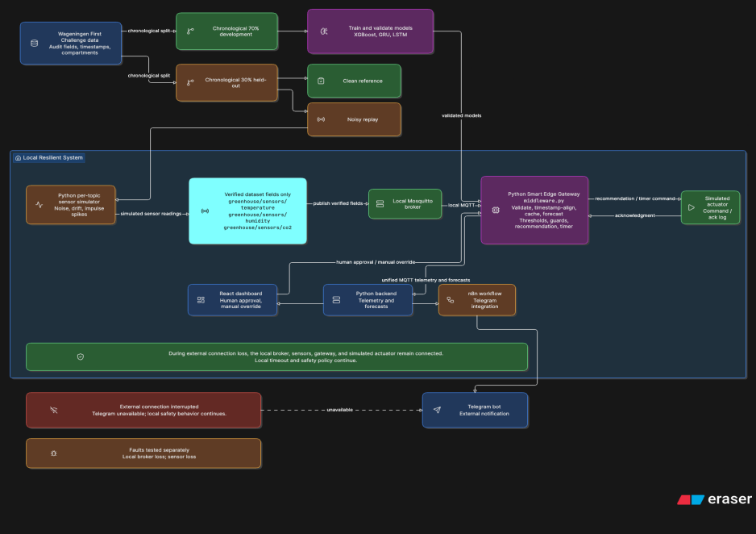

# Greenhouse Edge Inference System

Event-driven Edge AI architecture for autonomous closed-loop smart greenhouses, built with an all-Python machine learning and backend pipeline, a Smart Edge Gateway over MQTT, and a React + n8n/Telegram Human-in-the-Loop (HITL) oversight plane.

The system forecasts indoor air **temperature**, **relative humidity**, and **CO2 concentration** 15 minutes ahead (3 steps at 5-minute intervals) using candidate **XGBoost**, **GRU**, and **LSTM** models trained on the Wageningen Autonomous Greenhouse Challenge dataset. Noisy sensor streams are aggregated locally on a simulated or physical **Raspberry Pi 5 Edge Gateway**, evaluated against rule-based crop thresholds, and routed through a dynamic timeout fallback policy with manual override support via a React dashboard and Telegram bot.

Greenhouse-Edge-Inference-System/
├── mosquitto_local.conf               # Local MQTT broker config (port 1883)
├── python/
│   ├── data/                          # Raw CSV, clean/noisy splits, and .npy arrays
│   ├── models/                        # Saved artifacts: xgboost_model.json, gru_model.keras, lstm_model.keras
│   ├── middleware/
│   │   └── middleware.py              # Smart Edge Gateway (MQTT aggregation + live inference)
│   ├── wageningen_data_pipeline.py    # CLI pipeline (--mode prepare | train | stream)
│   ├── visualize_noise.py             # Clean vs. noisy sensor visualization script
│   └── edge_benchmark.py              # Multi-criteria model evaluation (RMSE, MAE, CPU, RAM, latency)
├── backend/                           # Python FastAPI REST + WebSocket server & MongoDB client
├── dashboard/                         # React analytics & manual override frontend
└── n8n-flows/                         # Telegram bot HITL alert & command workflows